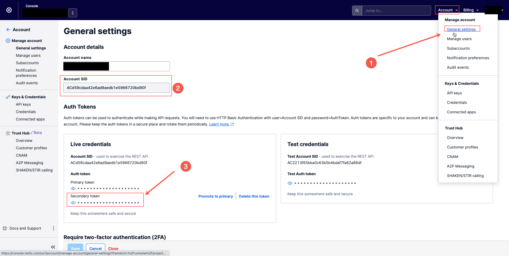
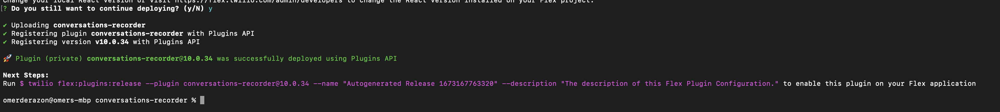
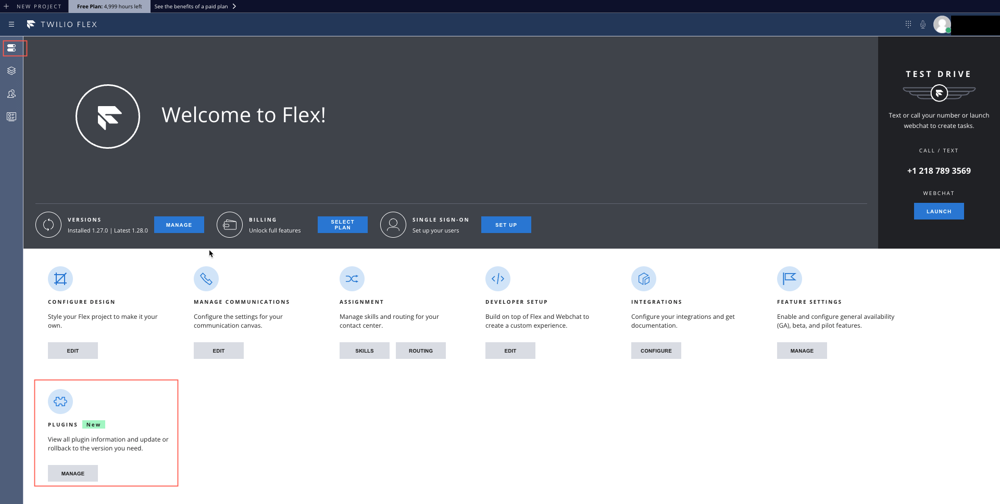
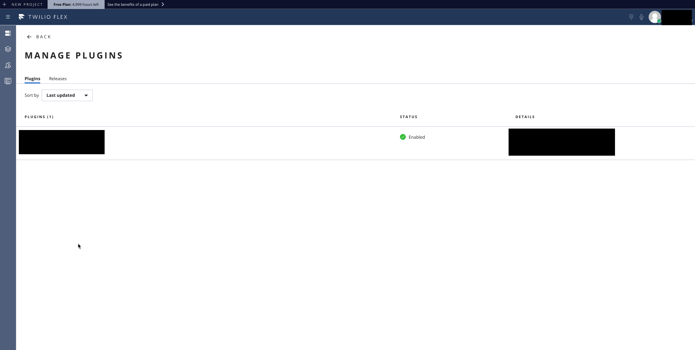

# Sedric's Flex Plugin

Integrate your Twilio account with Sedric using a dedicated plugin

## Setup

Make sure you have [Node.js](https://nodejs.org) as well as [`npm`](https://npmjs.com). We support Node >= 10.12 (and recommend the _even_ versions of Node). Afterwards, install the dependencies by running `npm install`:

Follow these steps:

1. Install the dependencies via npm
    ```
    npm install
    ```

2. Please install the [Twilio CLI](https://www.twilio.com/docs/twilio-cli/quickstart) by running:
    ```
    brew tap twilio/brew && brew install twilio
    ```
3. Install the [Flex Plugin extension](https://github.com/twilio-labs/plugin-flex/tree/v1-beta) for the Twilio CLI:

    ```
    twilio plugins:install @twilio-labs/plugin-flex
    ```
4. Fetch your accound SID and token and login to you Twilio account via CLI
    
    

    ```
    twilio login
    ```
5. Deploy the plugin using the following command
    ```
    twilio flex:plugins:deploy --changelog "Sedric's Plugin" --version=0.0.1     
    ```
6. Run the auto-generated command to enable the plugin in the account
    
    
    
7. Validate that plugin is enabled in the account

    
    